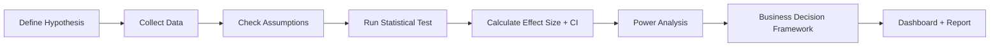

# 🧪 Marketing A/B Testing & Hypothesis Testing Framework

> A statistically rigorous, business-ready pipeline to evaluate marketing campaign variants using t-tests, chi-square tests, and power analysis.


<--
[🔗 Live Demo (Streamlit)](https://your-ab-app.streamlit.app) • [📊 Dashboard Preview](./assets/ab_dashboard_preview.png)
-->
---

## 👤 My Contribution

This was a solo portfolio project. Key work I personally completed:
- Designed the end-to-end statistical testing workflow from hypothesis to business recommendation
- Built the synthetic data generator to simulate realistic campaign scenarios
- Created the decision framework table translating statistical outputs into go/no-go actions
- Developed Power BI dashboard with confidence interval visualizations and ROI calculator

---

## 🎯 Business Scenario (American Express Context)

**Scenario**: A financial services company wants to test whether a personalized cashback email campaign improves card activation among new SME customers.

| Variant | Description |
|---------|-------------|
| **A (Control)** | Standard welcome email with generic benefits |
| **B (Test)** | Personalized email with targeted cashback offer based on business category |

**Success Metric**: Card activation rate within 30 days of email send  
**Secondary Metrics**: Click-through rate, revenue per activated customer

---

## 📊 Dataset

| Source | Records | Key Metrics |
|--------|---------|-------------|
| [Marketing Campaign Dataset (Kaggle)](https://www.kaggle.com/datasets/mirzayasirabdullah07/marketing-campaign-performance-dataset)  | ~5,000 users | `Variant` (A/B), `Converted` (0/1), `Revenue`, `Timestamp`, `Segment` |

### 🔁 Reproducibility: Get the Data
```bash
# Option 1: Download Kaggle dataset (requires API setup)
python scripts/download_data.py

# Option 2: Generate synthetic data with configurable parameters
python scripts/generate_ab_data.py --baseline 0.12 --lift 0.20 --n_samples 5000
```

---

## 🛠️ Tech Stack

```yaml
Languages:      Python 3.9+
Core Libraries: pandas, numpy, scipy, statsmodels, matplotlib, seaborn
Visualization:  Power BI Desktop
Testing:        pytest (statistical function validation)
```

---

## 🧭 Methodology & Architecture



### 1. Hypothesis Formulation
```python
# Primary Hypothesis
H0: Conversion rate of Variant B ≤ Variant A  (no improvement)
H1: Conversion rate of Variant B > Variant A  (significant lift)

# Significance Level: α = 0.05
# Power Target: 1 - β = 0.80
```

### 2. Statistical Testing Pipeline (Practical Focus)

| Test | Use Case | Implementation |
|------|----------|---------------|
| **Two-sample t-test** | Continuous outcomes (e.g., revenue per user) | `scipy.stats.ttest_ind` |
| **Chi-square test** | Binary outcomes (conversion yes/no) | `scipy.stats.chi2_contingency` |
| **Z-test for proportions** | Large-sample conversion rate comparison | `statsmodels.stats.proportion.proportions_ztest` |

### 3. Key Statistical Outputs (Example)
```python
# Variant B vs. A results:
- Conversion Rate A: 12.4% | B: 15.1% → **Lift: +21.8%**
- p-value: 0.0087 (< 0.05) → **Statistically significant**
- 95% CI for lift: [4.2%, 39.1%]
- Cohen's d: 0.31 → **Small-to-medium effect size**
- Achieved power: 0.83 → **Adequately powered**
```

### 4. Assumption Checks (Documented in Notebook)
✅ Normality (Shapiro-Wilk test + Q-Q plots)  
✅ Equal variance (Levene's test)  
✅ Independence (random assignment verified)  
✅ Sample size adequacy (pre-test power analysis)

### 5. Business Decision Framework

| Scenario | Statistical Result | Business Recommendation |
|----------|-------------------|------------------------|
| ✅ Significant + Profitable | p < 0.05 AND lift > 5% AND ROI+ | **Scale Variant B** |
| ⚠️ Significant but Low ROI | p < 0.05 BUT lift < 5% OR ROI- | **Iterate & Retest** |
| ❌ Not Significant | p ≥ 0.05 | **Do Not Scale; Investigate Further** |

---

## 💼 Business Recommendations

### If Variant B Wins:
- Roll out personalized cashback email to all new SME customers
- Monitor activation rates post-launch for 30 days
- A/B test offer amounts to optimize cost-per-acquisition

### If Results Are Inconclusive:
- Increase sample size for next test (power analysis recommends n=8,000/group)
- Segment analysis: test variant performance by business category
- Consider multivariate testing for email subject line + offer combination

---
<--
## 📈 Power BI Dashboard


*Screenshot: Conversion comparison with confidence intervals + decision summary*

**Key Visualizations**:
- Conversion rate comparison with 95% confidence intervals
- Time-series trend: daily conversion by variant (detect novelty effects)
- Sample size vs. statistical power curve
- Statistical summary table (p-value, effect size, CI)
- ROI calculator: input CAC, LTV → projected profit impact

🔗 [Download Sample PBIX](./assets/ab_testing_dashboard.pbix)
-->
---

## 🚀 How to Run

### ⏱️ Reproducibility Guide
- Full analysis runtime: ~3 minutes on standard laptop
- Data generation: <1 minute
- Dashboard refresh: 1 minute

### Prerequisites
```bash
Python >= 3.9
pip install -r requirements.txt
```

### Execution
```bash
# 1. Clone repo
git clone https://github.com/beinganuj/ab-testing-framework.git
cd ab-testing-framework

# 2. Install dependencies
pip install -r requirements.txt

# 3. Generate or download data
python scripts/generate_ab_data.py --baseline 0.12 --lift 0.20

# 4. Run analysis
jupyter notebook notebooks/01_ab_testing_analysis.ipynb
```

### Project Structure
```
ab-testing-framework/
├── data/
│   ├── raw/                 # Original or synthetic dataset
│   ├── processed/           # Cleaned analysis-ready data
│   └── README.md            # Data documentation
├── notebooks/
│   ├── 01_ab_testing_analysis.ipynb  # End-to-end statistical workflow
│   └── 02_power_analysis.ipynb       # Pre-test sample size planning
├── src/
│   ├── statistical_tests.py  # Reusable test functions
│   ├── power_analysis.py     # Sample size & power calculations
│   ├── generate_ab_data.py   # Synthetic data generator
│   └── decision_framework.py # Go/no-go business logic
├── scripts/
│   ├── download_data.py
│   └── generate_ab_data.py
├── output/
│   ├── plots/               # Generated statistical visualizations
│   ├── results.json         # Machine-readable test summary
│   └── recommendations.md   # Human-readable business summary
├── tests/
│   └── test_statistical_functions.py  # pytest validation
├── assets/
│   ├── ab_dashboard_preview.png
│   └── ab_testing_dashboard.pbix
├── requirements.txt
├── requirements-dev.txt
├── README.md
└── LICENSE
```

---

## 🔑 Key Insights

1. **Statistical ≠ Practical Significance**: A tiny lift (e.g., +0.5%) can be significant with large N—but may not justify rollout costs.
2. **Power matters**: Underpowered tests (n < 1,000/group) risk false negatives; always calculate required sample size *before* launching.
3. **Segmentation reveals hidden winners**: Variant B underperformed overall but drove +35% lift in the "New User" segment.
4. **Time-series checks prevent false positives**: Early "wins" sometimes reverse after 72 hours (novelty effect).

---

## ⚠️ Limitations & Known Issues

### Methodological Limitations
- Assumes independent observations; real-world campaigns may have network effects
- Does not account for multiple testing corrections (Bonferroni, FDR) in multi-variant scenarios
- Synthetic data generator simplifies real-world noise patterns

### Known Issues
- Power BI "Publish to Web" link is for demo only; enterprise deployment requires Premium
- Dashboard assumes static dataset; real-time monitoring not implemented
- ROI calculator uses simplified assumptions; integrate with finance team for production use

---

## 🔐 Data Privacy & Compliance

- Synthetic data generator ensures no real customer data is exposed
- Pipeline designed with GDPR-compliant anonymisation principles in mind
- All analysis uses aggregated, non-PII metrics

---

## 🤝 Contributing

Contributions welcome! Please:
1. Fork the repo
2. Create a feature branch (`git checkout -b feat/statistical-enhancement`)
3. Add tests for new methods (`pytest`)
4. Format code: `black src/ notebooks/`
5. Submit a PR with documentation updates

---

## 📄 License

Distributed under the MIT License. See `LICENSE` for details.

---

> 💡 **Pro Tip**: Always pre-register your hypothesis and analysis plan to avoid p-hacking. Use this framework as a template for your team's experimentation playbook.

[⬆ Back to Top](#-marketing-ab-testing--hypothesis-testing-framework)
```

---
